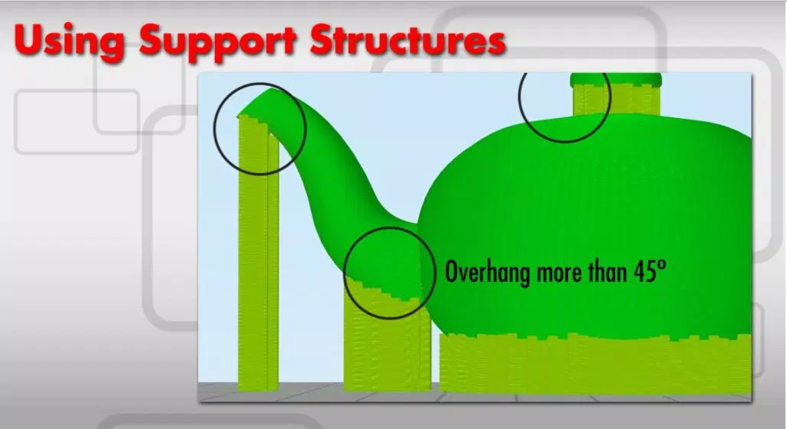
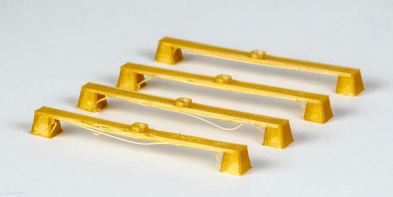
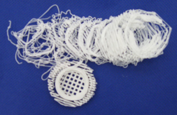
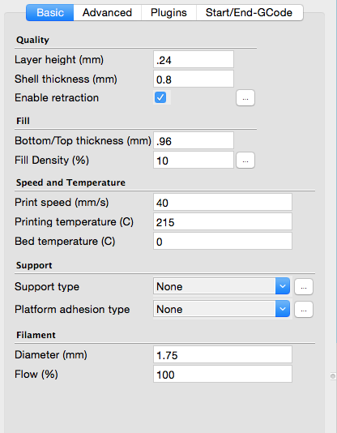

# Beginner’s Guide to 3D Printing

## There are 3 basic parts to printing.

1. Getting something to print.
    -Usually, this is an STL file. It could also be an OBJ file. Think of this as your 3D drawing.
    -Most programs can export as one of these file types.
    -To get started right away, browse [thingiverse](https://www.thingiverse.com/), [stlfinder](https://www.stlfinder.com/), [yeggi](https://www.yeggi.com/), [pinshape](https://pinshape.com/), and more to download a file. Try for one that has pictures of it being printed.
    -If you are interested in designing, check out [tickercad](https://www.tinkercad.com/), [openSCAD](https://www.openscad.org/), [blender](https://www.blender.org/), [zbrush mini](https://zbrushcore.com/mini/). They are free 3D modeling tools.
2. Preparing the file for printing
    -Slicers turn the design you want to print into instructions for the printer. You put in an STL file, and you get gcode/x3g/makerbot files.
    -The slicer depends on your printer.
    -The Makerbot uses their own program, Makerware. The mbot uses a specific version of Makerware.
    -Most Reprap designs can use [Cura](https://ultimaker.com/software/ultimaker-cura), Repetier-Host, or Simplify3D
3. Giving the printer the instructions
    -The makerbot takes a usb drive, most other printers use an SD card.
    -Sometimes the computer is hooked up to the printer so all you have to do it hit print!
    
## Making Sure Your Model is Printable
There is a lot to get into with 3D Design, and to print you don’t really need to know it, so I am just going to go over some design basics that make it easy to print. Be sure to look for these characteristics in models you download- sometimes there will be a cool design that would be very difficult to actually print!

1. Overhangs
    -3D Printing cannot print out into thin air- you need to use supports if the overhand angle is more than 45 degrees. You can get around this if you are ‘bridging’ – sprinting a straight line between two points.
2. Stick the Landing
    -3D Prints need a good base to stick to the printing platform- trying to print a perfect sphere might be a little difficult with only coming in contact with the platform on a small point. The less it sticks, the more likely it is to come free from the platform during printing and give you some lovely 3D printed spaghetti.
    -Sometimes this can be helped by enabling the ‘raft’ setting int he slicer. The raft is a little plate that the model prints on top of- if helps stick to the bed with just the right amount of stick.
3. Features that are too small
    -Things like text can easily get too small to be distinguishable.
4. Stress points that are too small
    -Things like arms and other appendages might be too thin to support the weight or break under a small amount of pressure.
5. Non Manifold
    -Models need to be ‘water tight.’ That means no holes and no edges connected to more than 2 faces. You can repair common problems here. (You need a Microsoft Account, unfortunately. )
6. Resolution
    -Watch out while scaling a model up or down- sometimes parts that shouldn’t are too close not to fuse together when you scale down, or it begins to look worse from seeing the polygons when you scale up.

### Support Structures for angles more than 45 degrees

### Bridging between two points, a workaround to the 45 degree limit

### A raft not sticking

## Using the Slicer
For this guide, we are going to assume the machine is already set up with the slicer of choice. While we will be using Cura, many of these settings are the same or similar across the different software packages.

1. Basics
    -The load icon (looks like a folder) to add your STL file.
    -Click and drag to move.
    -The icons in the lower left rotate, scale, and can mirror your object.
    -Icon in the upper right to change view. you can use this to change to ‘Layers’ and see if you have any overhangs or how big the bottom layer is.
    -To apply the settings changes, sometimes you have to move the object around.
2. Filament Specific Settings
    -Printing Temp: For PLA (most common) can be anywhere from 185-220°C. ABS is around 230°C
    -Bed Temp: 70°C for PLA (optional, but helps with warping and sticking), 110°C for ABS
    -Diameter: Mostly you want to keep this at 1.75mm, but sometimes a lower quality filament can be more or less.
3. Quality
    -Layer Height: .3mm is low and fast, .2 is standard, .1 is high quality and very slow. This only effects the layers going alone the Z axis.
    -Print Speed: Going as low as 25mm/s can improve X and Y resolution. Otherwise, keep it at the normal speed (40-90mm/s)
4. Structural Integrity:
    -Most printed parts are very hollow. This saves filament and allows the print to cool as it prints. Sometimes, however,  you need a part to be able to stand up to a bit of pressure.
    -Shell Thickness: This divided by your nozzle size determines how thick the outer shell on the X and Y axis are.
    -Bottom/Top Thickness: Keep this a multiple of layer thickness.
    -Fill Density: 10% normally, as much as 30% for a stronger part.
5. Bed Adhesion
    -Brim: This adds a row of layers attached to your print- helps with warping, sometimes a pain to clean off the print.
    -In order to clean the nozzle, I like to add a skirt. This is in the advanced settings. This way by the time it gets tot he real print, it has it’s act together.
    -If the bottom of the print isn’t big enough to stick, use the “Cut off object bottom” to sink it into the platform and increase the surface area.
6. Supports
    -If you need them, you can add supports here.
    -Unfortunately, they are often difficult to remove- use carefully.
    -You can model around the need for these, add your own, or just try it anyway- you never know. Life, uh, finds a way.
    -The best supports I have used are from Simplify3D- a paid slicer.
7. Send to Printer
    -If the printer is attached over USB and active, the save icon should send it right to the printer.
    -If an SD card is inserted, it will save it directly to the card.
    -Otherwise, you can save it anywhere and transfer it later.
    -The file you save is your instructions for the printer and you will not be able to recreate the model from it.

## Actually Printing
This is where the magic happens! Don’t be discouraged by a failed print- this is process is trial and error.

1. Getting the gcode to the printer
    -The i3pro can be controlled from the tethered computer or an SD card if it has an LCD screen.
2. Surface
    -Make sure your surface of choice is clean and ready. I like to use blue painter’s tape, some like to print right on the glass with mod podge.
    -If your surface isn’t perfect, move the model around to avoid it (Just be sure to replace it after for the next guy)
3. First Layer
    -ALWAYS watch the first layer- it is the most important. A print that doesn’t stick is doomed from the start. If it doesn’t stick, go back to the slicer to try and change that.
4. Only leave a print alone after you have printed it successfully with the same settings before, and be respectful about tying up the available printers.
5. Watch for warping, the print dislodging, even the print head knocking the print off the platform.

