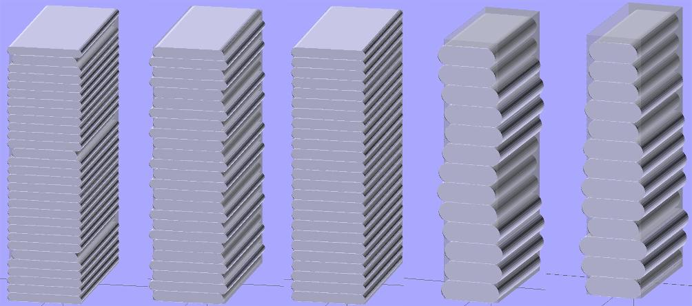
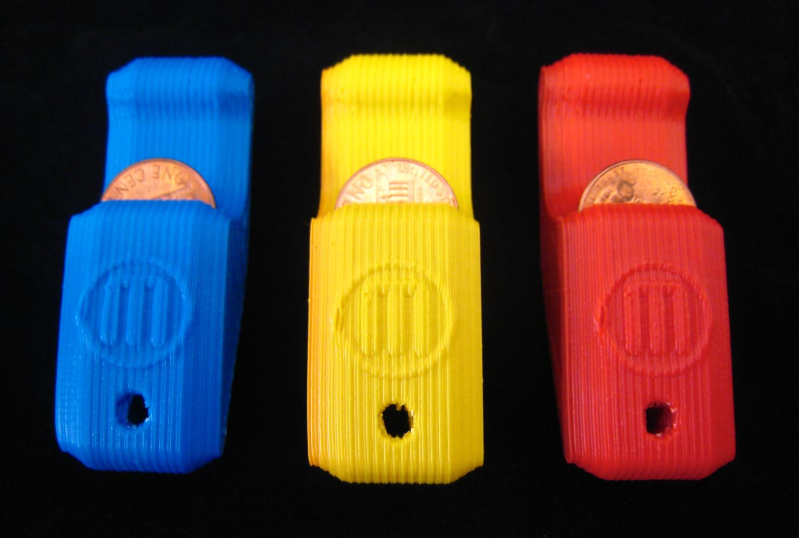
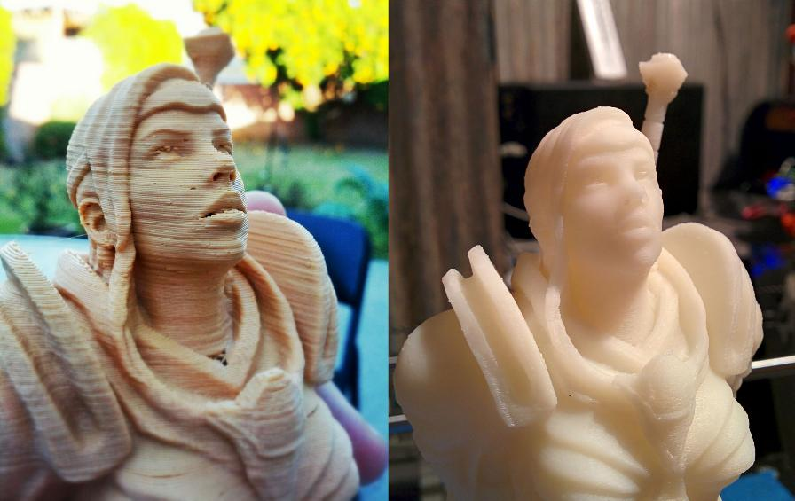

# Z Banding Troubleshooting

If you have ever tried to get rid of z-banding, you know it is very frustrating as there are a lot of factors. Here I am putting a [fantastic evernote post on the subject](https://www.evernote.com/shard/s211/client/snv?noteGuid=701c36c4-ddd5-4669-a482-953d8924c71d&noteKey=1ef992988295487c98c268dcdd2d687e&sn=https%3A%2F%2Fwww.evernote.com%2Fshard%2Fs211%2Fsh%2F701c36c4-ddd5-4669-a482-953d8924c71d%2F1ef992988295487c98c268dcdd2d687e&title=Taxonomy%2Bof%2BZ%2Baxis%2Bartifacts%2Bin%2Bextrusion-based%2B3d%2Bprinting)! It has been really useful for me. It let me know that I needed to fine tune my PID settings! One trick if you happen to be using colorfabb PHA/PLA blend, it melts smoother, but it a bit more sensitive to temp change. If you have a lot of banding with colorfabb but not a pure PLA, it is probably PID settings. ( Colorfabb has a lot of quality control over the filament diameter. )

Also, get a filament tube- it really evens out the tug on the filament roll, which helps extrusion width and has led to less tangles for me. (I even put a filter on the end.)

———————————————–

Recently, printer designs have been multiplying like Stanford Bunnies. With the “Kickstarter generation” of 3d printers, I’ve noticed a lot of old mistakes being made by people who are new to the community and haven’t done as much research as one might hope. Some of these mistakes have mostly been documented in comments and mailing list replies, so I thought it was time they were more formally documented. In this post, I want to talk about issues that cause distortion on vertical surfaces of prints.

*.05 layers with 18 threads/inch screws, .06 layers with M8 screws (1.25mm pitch), .06 layers with M6 screws (1mm pitch), Z wobble, bad filament tolerance*

###Regular Z artifacts:
The most recognizeable cause of this problem is Z-wobble. It is caused by the misalignment of layers in a repeating pattern with a period equal to the Z thread pitch (technically the lead, but this is the same as the pitch unless you are using a multi-start thread), and was a famous problem of the original Makebot, the CupcakeCNC. The CupcakeCNC’s Z axis was constrained by four M8-threaded rods that turned to move the axis up and down. The problem is that while some of these rods are straighter than others, none are ever perfectly straight. The top and bottom of the rods were held in place with bearings, but when the rods aren’t straight, the Z axis will be offset. Rods clamped in bearings will also be off-center due to the hole being larger than the thread’s maximum diameter and some quirks of nut manufacturing (Cupcake users long ago realized that it was better to rest a locked pair of nuts on the bearing rather than clamping the bearing with one nut on each side as the build instructions suggested). When the rods turn, the Z platform moves up or down along the Z axis, but it also moves in small circles around it, causing the layers to be misaligned and resulting in sinusoidal ridges along the vertical surfaces, with inverted ridges on the opposite side.

*Classic Z wobble on a CupcakeCNC. Photo credit: John Abella*
Z-wobble was never a problem for Mendel-like designs until recently. The original Mendel did not have this problem because its Z axis was constrained by smooth rods, with threaded rods held by bearings on one end that only move it up and down. The Prusa Mendel created a similar system by coupling the threaded rods directly to motor shafts at the top (which in turn were held in place by the twin stepper motors’ integral bearings), and the Prusa i3 (which, thankfully, moves those motors to the bottom) still has those threaded rods constrained at only one end. I mention these models specifically because there have been several derivatives and so-called “upgrades” for these designs that place another bearing at the opposite ends of the threaded rods.
In these designs, when the rod is only constrained at one end, if the rod is not perfectly straight (which none are), the free end will move in small circles the way the CupcakeCNC’s platform did, but the Z axis will not be affected because the smooth rods constrain it to a linear path, and the shaft couplers allow a bit of flex when the Z nuts push the rod in one direction or another. Some less experienced users were confused or concerned by the wobble exhibited by the free ends of these rods and decided to put bearings on them to prevent this wobble. In fairness, on the Prusa Mendels with the motors at the top, they also served to take the weight of the X axis and extruder off of the shaft coupler, which was prone to being pulled apart in early versions, but the downside was the same. With both ends of the threaded rod now constrained as on the CupcakeCNC, the curvature of the rod again started pushing the Z platform in small circles around it. The smooth rods resisted this force, and tried to bend the threaded rods straight to counteract it, but the threaded rods were just as thick, so the result was that both rods deflected a bit, and Z wobble was allowed to occur.
As people have been pushing for higher-quality, error due to Z axis quantization and precision limits have started to appear, creating banding in an interference pattern that I’ll call Z ribbing. I’ve seen this issue over and over recently, and it is the primary reason for this post. Instead of entire layers being offset in one direction, this error appears as layers sticking out too far or not far enough in every direction. Like Z wobble, this error occurs with a regular period, but it is not the same as the Z thread pitch (though it may be very close). It occurs due to a rounding error in the number of steps per layer causing some layers to be shorter or taller than others, and threads being laid down with the same cross-sectional area will come out wider if they are compressed to a shorter height, and thinner for error in the other direction. This error is often mistaken for Z wobble, and is easily obscured by actual Z wobble as well as several other issues.

*Z ribbing due to using non-metric screws. Photo credit: Jason Gullickson*

Z ribbing is caused by choosing the wrong layer height for your Z screws. It is more apparent with thinner layers because the percent-error in the layer height is greater, and because the vertical surfaces of prints with thinner layers should otherwise be smoother. The error is much harder to avoid if you use an inch measurement thread pitch (more on this in later) or if you have some microstepping inaccuracy. Because microstepping inaccuracy can be hard to get rid of entirely, you should assume that you have some, and should always choose layer heights that are a multiple of your full-step length. If you are in half-step mode, your half-steps will all be accurate, but the 3/16 step position will not reliably be half a step away from the 11/16 step position, so you should only rely on accurate half-step intervals if you are actually in half-step mode. This error is non-accumulating, which means that after some number of steps, the rounding error will shift to the other direction, creating a layer that is slightly taller (and thus less compressed) than other layers, or that is shorter and over-compressed. Because the volume of the extrusion is constant but the height is not, the width of extrusion will be different and banding will appear on the surface, as illustrated in the photo above and the first two illustrations at the beginning of this article.

To avoid Z ribbing, you should always choose a layer height that is a multiple of your full-step length. To calculate the full-step length for the screws you’re using, take the pitch of your screws (I recommend M6, with a pitch of 1mm) and divide by the number of full-steps per rotation on your motors (usually 200). Microsteps are not reliably accurate enough, so ignore them for this calculation (though using microstepping will still make them smoother and quieter). For my recommended M6 screws, this comes out to 5 microns. It’s 4 microns for the M5 screws used by the i3, and 6.25 microns for the M8 screws used by most other repraps. A layer height of 200 microns (.2mm), for example, will work with any of these because 200 = 6.25 * 32 = 5 * 40 = 4 * 50.

This also illustrates why you should never use screws with an inch measurement thread pitch. They are fine for the structural construction, but should not be used for the Z screws. The 5/16-18 threaded rods commonly used as a substitute for M8, for example, have a pitch of 1.41111111mm (the repeating decimal tells you you’re screwed, so to speak) for a single-step length of 7.0555555 microns. Theoretically, you should be able to use the following layer heights without a rounding error causing artifacts (in microns): 63.5, 127, 190.5, 254, 317.5, 381, 444.5. Any multiples of the full-step length between these will have rounding errors every 9 layers due to the repeating decimals. Layer heights that are not multiples will exhibit Z ribbing with a different frequency depending on how often they sync up with the full-step length. The errors will be smaller if you have accurate microstepping, but there will still be error. In fact, because this data is stored by the firmware in the form of a steps/mm value, ANY non-metric pitch will result in a non-terminating decimal that cannot be stored without rounding in a floating-point variable. The steps-per-unit variable stored in firmware would result in more accurate math if it was instead stored as units-per-step, but I’m told that this inverted math, even with the conversion to from floating-point to fixed-point calculation that it would allow, would add a significant computational burden to the microcontroller, which lacks a hardware-accellerated division function. Rounding errors due to not being able to store the exact value in the steps/mm variable will result in a very small error in the total size of your prints, which will be well below the margin of error for any measurement, but the non-accumulating error is a bigger problem.

Similar banding has been seen with a period equal to the thread pitch. This banding is caused by a mechanical issue causing the Z screws to move up and down slightly and/or vary in degrees per step over the course of their rotation, but these are rare now that most printers have their Z screws coupled directly to motors rather than through a belt system that can introduce this type of error. This banding is more closely related to Z wobble, but it results in layers being offset vertically rather than horizontally.

### Irregular Z artifacts:
There are several issues that can cause irregular banding. These cause layers to spread differently like Z ribbing, but they are more stochastic rather than occurring at regular intervals. These can be lumped into two categories: those that, like Z ribbing, cause variations in layer height, and those caused by differences in the volume of filament extruded into layers of equal height.
Irregular variation in layer height is caused by the platform or the extruder not maintaining the proper height while printing. On a cantilevered Z axis, this can be caused by binding or by wires pulling. In these cases, this resistance will cause the axis to not move enough in some layers, making those too short and wide, and then catch up in others that will be too tall and narrow.

A similar and probably more common error is resistance from the spool pulling against the extruder, which will tend to lift it. This is most prevalent on machines that move the extruder on the Z axis, especially if it is on a cantilevered platform like on the Thing-o-matic. In these cases, the filament will pull until there is enough tension to pull it loose, and the extruder will fall back to its normal position. How long this takes will depend on how much plastic is fed through the extruder rather than how far the Z axis moves, so the artifact will look different on prints with a lot of area per layer vs. ones with very little. You can prevent this problem by running the filament through a low-friction tube from the extruder to the spool (or to some structural fixed point between the extruder and the spool. The material doesn’t have to be quite as low-friction as a bowden tube, but it should be looser around the filament because a tight tube increases friction, and preventing backlash inside it is not a concern. Dirt-cheap and widely available (Home Depot stocks it) .17″ ID HDPE tube will do the job nicely.

*Before and after adding a feed tube. Photo credit: Ben Van Den Broeck*

Low-frequency temperature swings can also cause some layers to spread out more than others because they are extruded too soft, and I’ve also seen temperature swings on a heated platform cause this uneven heights. Some platforms will expand or bow as they heat enough to affect the layer height and create inconsistent layers. This should be particularly true of platforms with a low enough resistance to heat quickly with the supplied voltage because the fast heating will cause more differential expansion and bowing as the heater turns on and off. In the case I saw this, the board was a prototype and the next version didn’t have the issue. Short of replacing the heater, I’m not entirely sure what to do about this, but you can identify this issue if PLA on blue tape prints fine, but you get inconsistent layer heights when you heat it to print ABS. Tune your PIDs and make sure your temperatures are as steady as possible. The popular Marlin firmware can automatically tune its PID with the M303 code.
The other class of irregular Z artifact is caused by layers that are the same height, but do not have the same amount of plastic. These artifacts are caused entirely by the extruder and filament. For layers with a low volume (thin layers that also don’t have much area), this can be caused by an eccentric extruder gear, but most gears will make several full rotations and spread the error out within a layer rather than causing an inconsistency between layers. A more likely cause is inconsistency in the filament.
Filament must be uniformly round (flattened filament will have different minor and major diameters, which will affect how it presses into the drive gear and thus how fast it feeds) and must have as little variation in diameter as possible. Some low-quality filament also has bubbles down the center that change the cross-sectional area. These are not issues for plastic welding, which is what a lot of low-quality filament is actually manufactured for, and real 3d printing filament is manufactured to more exacting specifications, so you won’t get the best quality prints from El Cheapo filament. This is not to say you need to break the bank, just check tolerance ratings and look for reviews or test samples when looking for a supplier. There are some good value suppliers popping up these days. This is also a major reason that none of the desktop filament extruder projects have yet been very successful. There has been some work toward developing sensors to detect changes in filament dimensions in real time, as filament enters the extruder, but this is complicated by the delay in reaction between plastic feeding through the drive mechanism and coming out of the nozzle.
https://www.evernote.com/shard/s211/sh/701c36c4-ddd5-4669-a482-953d8924c71d/1ef992988295487c98c268dcdd2d687e

=================
CORRECTION:

An M8 lead screw has a pitch of 1.25mm. That is not true. An M8 lead screw will tipically have a 2mm pitch, which results in a completely different calculation. Threaded rods have 1.25mm pitch, but they are not used in 3D printers for positioning.

The full step length with an M8 lead screw will be 6.25 microns. That is again not correct. 2mm/200=0.01mm. If you add microstepping, then you get 2mm/(200*16) = 0.000625mm.

So if a full step is 0.01mm, then practically any layer height will be a multiple of that, namely 0.01, 0.02, 0.03 and 0.09, 0.1, …. 0.19… and so on.
Thanks Gabriel!

