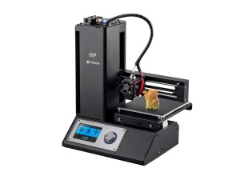
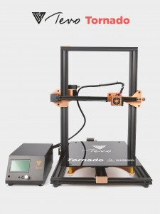
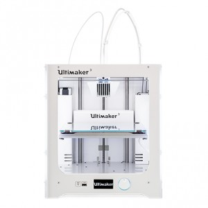

# What is a good first 3D printer?

I love 3D printing and the printers are getting better all the time, it is a very exciting time to be printing! I am going to focus on FDM style printing for this article- resin, powder, and other much more expensive, messy methods are much farther from the reach that FDM currently has.

Used FDM printers can be tempting- you are getting a better machine for a lower cost- but I don’t think they are a good experience for first time users.

Why I don’t Recommend a Used 3D Printer as a first machine:

   -The Industry is evolving so rapidly that a design from a couple years ago is probably already significantly improved on or reduced in price. I remember when I was excited for a $650 metal printrbot simple. Now a comparable machine is less than $200. (No wonder they couldn’t keep up- miss them.)
   -Almost every part of the printer is a consumable- it isn’t like a car that you can avoid replacing parts with proper maintenance. Using a printer wears stuff out, and replacing and troubleshooting these issues can be very frustrating for a first time user.
   -If you have one working machine, it is often easier and less frustrating to troubleshoot another. Some parts (not many) can even be 3d printed!
   -Assembling, upgrading, and rehabilitating is a pretty different hobby than printing. I love making stuff- the printer is a tool I use to do that. If that is also what your priorities are, stay away from a used machine as your first.
   -If there is a makerspace in your area, I highly recommend trying out printing there- you can also see first hand what abuse other people can put these machines through.
   -A seasoned 3D printer expert can keep a machine chugging along happily- but they often underestimate how much of their expertise is needed to perform necessary maintenance on the machine they are selling. It comes so easy to them to keep it running, so they see the value in the printer- but that doesn’t mean it will come easy to you, meaning it may not be worth the investment.
   
## BUDGET PICK, FOR NON TECHNICAL FOLKS

[Monoprice MP Select Mini 3D Printer](https://www.monoprice.com/product?p_id=15365)

At the time of writing, the new printer is $189 and a refurbished is $119. It does not get much better than that!

Fully assembled. Heated build plate. Can print a surprising variety of materials, claiming to be able to print ABS and your common nozzle-killing specialty filaments such as wood/bronze. And sold my a company that is probably not going anywhere anytime soon, so a good size online community.

The largest con is the build size- a puny 4.7″ x 4.7″ x 4.7″ (119mm x 119mm x 119mm)

I actually don’t own one, but it is one of the more reliable machines at the makerspace I frequent and I have known a couple people who have these and are very happy.

##MAX VALUE PICK

[Tevo Tornado](https://homers3dprinter.com/collections/3d-printers/products/tevo-tornado-most-assembled-full-aluminum-frame-3d-printer-eu-plug-220v-shipping-from-germany-warehouse)
I LOVE my Tevo Tornado! Huge build area at 300mm x 300mm x 400mm.  Comes as pre-assembled as a printer this large could reasonable be, with great instructions. Less complicated to put together than an IKEA shelf. I upgraded mine to have an easily removable glass build plate and some handle knobs for the bed leveling knobs. At only $358 at the time of writing, it is an incredible value. Prints great. There is a pretty active google group for owners of the printer.

Biggest drawback: there is an issue with electronic feedback on the printer that creates a slight visual deformity known in the community as “salmon skin”. It is similar to z banding, but on the x and y axes. It is caused by electric feedback and hard to get rid of. [Though people try.](https://www.youtube.com/watch?v=KMoVxF0Yd2M) The regular, patterned look of this particular defect actually does not look all that bad, I consider this to be a somewhat minor drawback.

## LUXURY PICK

[Ultimaker 3 / Ultimaker 3 Extended](https://www.dynamism.com/3d-printers/ultimaker-3/pricing.shtml)

How could I possibly not choose the Ultimaker here? If cost is truly no object, highly recommend. They make the hotends modular and easy to change. Fantastic community.  Fantastic support. Unrivaled quality, and I mean it. Fully assembled. 197 x 215 x 200 mm build area for the 3. extra 100 mm in height for the 3 extended.

Downside: Cost. Cost. Cost. They cost $3495 new for the 3, $4295 for the 3 extended. Ouch. But they can charge that much because they are that good.

There are obviously a ton of great printers out there, and this is not a list of the only ones worth buying. As someone who has trouble not buying 3D printers, there is so much awesome stuff being developed and it is really fun exploring it. This is just my personal experience with getting new people into 3D printing with the least pain.

Happy printing!

